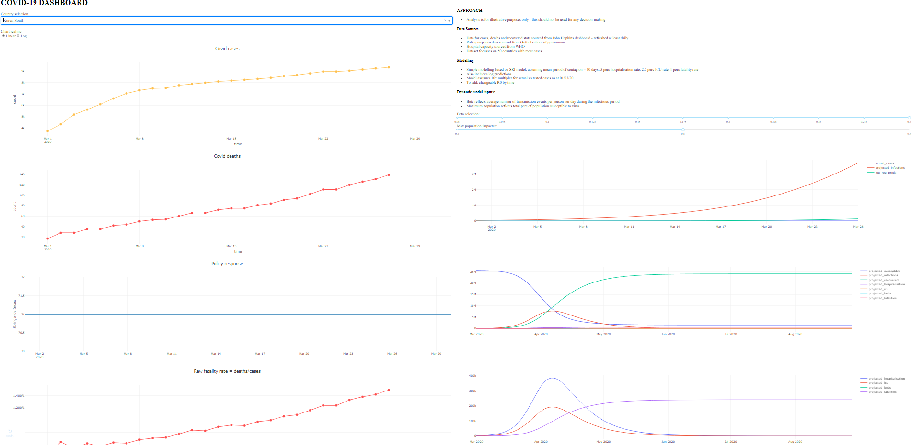

# COVID dashboard

### Project aim
- Monitor trends in actual covid cases and rates by country
- Provide dynmaic projections to visualise possible trends over 2020

### Modelling approach
1) Simple SIR modelling approach to forecast from reported figures on 01/03/20 with dynamic input to vary beta and max population affected
2) Panel regression on confirmed cases with country dummies and policy change dates

### Data sources
- John Hopkins dashboard daily feeds for confirmed cases, deaths and recoveries
- Hospital data from WHO
- Country statistics
- Covid policy change dates, manually compiled

# Dashboard
- Built in dash
